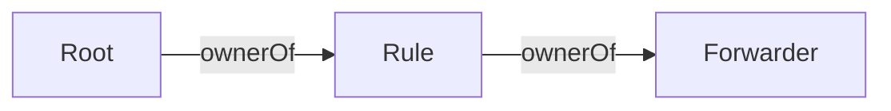
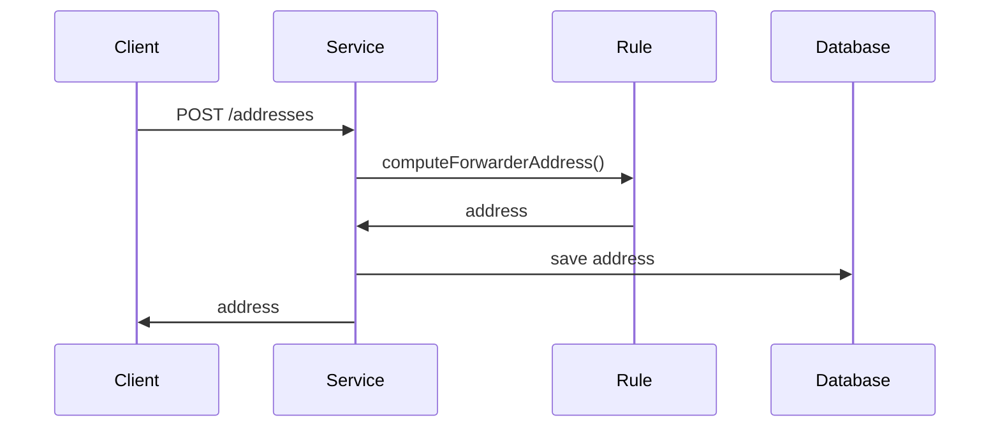
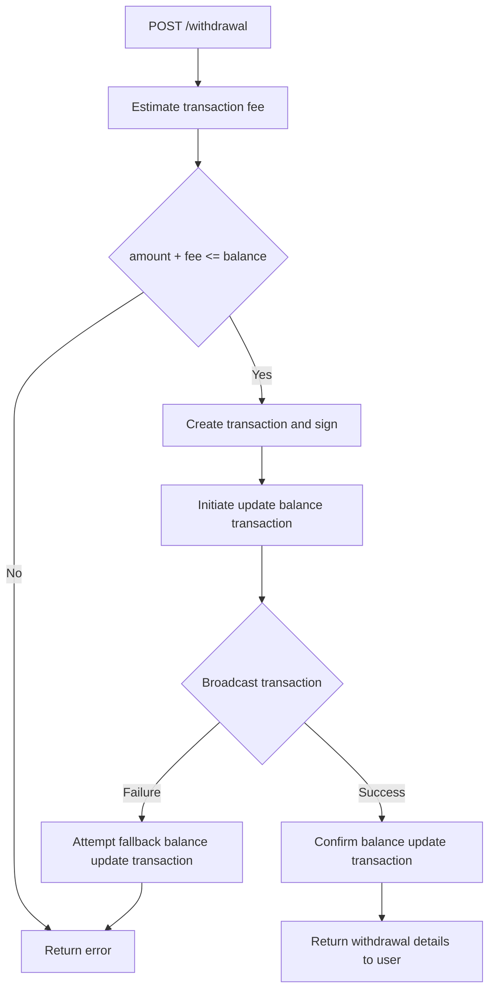

# Architecture of service S

## Table of content

- [Motivation](#motivation)
- [Terminology and entities](#terminology-and-entities)
- [Workflow](#workflow)
- [Technical overview](#technical-overview)
  - [Forwarder](#forwarder)
  - [Rule](#rule)
  - [Smart contracts hierarchy](#smart-contracts-hierarchy)
  - [Address creation](#address-creation)
  - [Balance](#balance)
  - [Monitoring and transactions processing](#monitoring-and-transactions-processing)
  - [Withdrawals](#withdrawals)
  - [Benefits of The Approach](#benefits-of-the-approach)
  - [Conclusion](#conclusion)

### Motivation

The motivation behind the development of Service S arises from the critical need to establish a robust and accurate system for tracking user deposits and handling their corresponding credits. Whether Service S functions as a token exchange or in any other capacity, the primary goal remains consistent: to ensure that user deposits are securely recorded and promptly reflected in the form of internal credits.

Service S acknowledges that users' trust hinges on the assurance that their deposits are accurately accounted for and instantly accessible when they opt for withdrawals. This motivates the implementation of a fault-tolerant architecture that is equipped to handle edge cases and unexpected scenarios. Through precise deposit detection and credit issuance, Service S aims to foster user confidence in the integrity of their deposited assets.

While the focus of this solution lies in the detection of deposits and issuance of fungible credits, it is worth noting that this document is agnostic to the specific functionalities that users may have within the service. The scope remains centered on ensuring the accuracy and reliability of user deposits and credits. By catering to in-browser frontend users, the solution emphasizes a user-centric approach, enhancing the user experience and encouraging user engagement.

In summary, the motivation behind the development of Service S is rooted in the commitment to provide users with a dependable and seamless experience when depositing ETH, tracking internal credits, and initiating withdrawals. By focusing on deposit detection and credit issuance, Service S sets the foundation for a user-centric and fault-tolerant system that fosters trust and accessibility.

### Terminology and Entities

To begin, let's establish the fundamental system entities and terms:

- Root Address: An Ethereum address controlled by Service S, where Service S possesses the corresponding private key. This address serves as the central collection point for all deposited Ether (ETH) and is used for withdrawal transactions.

- Receive Address: An Ethereum address associated with a user's identity. Each user is assigned a unique receive address, and users are limited to a single receive address each. Receive addresses are utilized for initiating deposit transactions.

### Workflow

This section outlines how the protocol functions for end-users, offering a non-technical overview of the processes involved.

1. **Authorization (User Identity)**

   1. For running Service S within a canister, user internet identity will be utilized for authorization. Before engaging with the protocol, end-users are required to create their own internet identity.

2. **Deposit**

   1. Prior to initiating any deposits, users MUST submit a request to create their unique "receive address."
   2. After obtaining the receive address, users can deposit Ether (ETH) to the provided address from various sources such as exchanges, wallets, and more.
   3. Following the transmission of ETH to the address, Service S is RESPONSIBLE for updating the user's balance post a specified number of confirmations (ideally 32, which aligns with the PoS epoch size).

3. **Withdrawal**

   1. Users are REQUIRED to submit a request to Service S to initiate a withdrawal. This request MUST include the amount (in wei) and the destination address.
   2. If the user's balance is less than the requested amount plus the estimated transaction fee, the withdrawal request will not be generated.
   3. Assuming the user's balance is greater than or equal to the amount plus the estimated transaction fee, Service S will facilitate the transfer of ETH from the Root address to the specified destination address.

### Technical overview

#### Forwarder

The core of our system is a forwarder. Special smart contract, which has an owner and receiver. It uses method `forward` to transfer ETH to the receiver. Access to this method restricted by modifier `onlyOwner`. Also it have receive() method to transfer all received eth to the receiver automatically.

```solidity
import {Owned} from "lib/solmate/src/auth/Owned.sol";
import {SafeTransferLib} from "lib/solmate/src/utils/SafeTransferLib.sol";

contract Forwarder is Owned {
  address public receiver;
  constructor(address _owner, address _receiver) Owned(_owner) {
    receiver = _receiver;
  }

  function forward(uint256 value) external onlyOwner {
    SafeTransferLib.safeTransferETH(receiver, value);
  }

  fallback() external payable {}

  receive() external payable {
    SafeTransferLib.safeTransferETH(receiver, msg.value);
  }
}
```

This smart-contract is an _implementation_ of the forwarder. This implementation will be deployed before service S will launch at the first time. The owner of this contract have to be another smart-contract called `Rule`.

#### Rule

This smart contract MUST be deployed by the Service S address, ensuring that the Root address becomes the owner of the `Rule`. It requires a single `constructor` argument, which is the forwarder implementation. Before deploying both the `Forwarder` and the `Rule`, it is ESSENTIAL to predict their addresses utilizing the `CREATE2` algorithm. This can be accomplished using utilities provided by OpenZeppelin: [https://docs.openzeppelin.com/cli/2.8/deploying-with-create2](https://docs.openzeppelin.com/cli/2.8/deploying-with-create2).

The central role of the `Rule` smart contract is to compute receive addresses using the provided `salt` and subsequently deploy a `Proxy` smart contract to that address. Following this deployment, it calls the `forward` method for the `Forwarder` proxy.

```solidity
import {Owned} from "lib/solmate/src/auth/Owned.sol";
import {Forwarder} from "./Forwarder.sol";

contract Rule is Owned {
    address public forwarderImplementation;

    constructor(address _forwarderImplementation) Owned(msg.sender) {
      forwarderImplementation = _forwarderImplementation;
    }

    function updateImplementation(address _newForwarderImplementation) external onlyOwner {
      forwarderImplementation = _newForwarderImplementation;
    }

    function deployForwarder(bytes32 salt) internal returns (address instance) {
      address implementation = forwarderImplementation;

      assembly {
        mstore(0x21, 0x5af43d3d93803e602a57fd5bf3)
        mstore(0x14, implementation)
        mstore(0x00, 0x602c3d8160093d39f33d3d3d3d363d3d37363d73)

        instance := create2(0, 0x0c, 0x35, salt)
        mstore(0x21, 0)
        if iszero(instance) {
          mstore(0x00, 0x30116425)
          revert(0x1c, 0x04)
        }
      }
    }

    function computeForwarderAddress(bytes32 salt) public view onlyOwner returns (address computed) {
      address deployer = address(this);
      address implementation = forwarderImplementation;

      assembly {
        mstore(0x21, 0x5af43d3d93803e602a57fd5bf3)
        mstore(0x14, implementation)
        mstore(0x00, 0x602c3d8160093d39f33d3d3d3d363d3d37363d73)
        let hash := keccak256(0x0c, 0x35)
        mstore(0x21, 0)

        mstore8(0x00, 0xff)
        mstore(0x35, hash)
        mstore(0x01, shl(96, deployer))
        mstore(0x15, salt)
        computed := keccak256(0x00, 0x55)
        mstore(0x35, 0)
      }
    }

    function forward(bytes32 forwarderSalt, uint256 value) public onlyOwner {
      address forwarderAddress = computeForwarderAddress(forwarderSalt);
      Forwarder forwarder = Forwarder(forwarderAddress);
      forwarder.forward(value);
    }

    function createForwarder(bytes32 forwarderSalt, uint256 value) public onlyOwner {
      address forwarderAddress = deployForwarder(forwarderSalt);
      Forwarder forwarder = Forwarder(forwarderAddress);
      forwarder.forward(value);
    }
}
```

#### Smart contracts hierarchy



#### Address Creation

To generate an address for an end-user, Service S, operating as the owner of the `Rule` smart contract, is REQUIRED to invoke the `computeForwarderAddress` function. As input, this function demands the use of `keccak(user_id || secret)` as the `salt`. The secret MUST be securely stored within the service's environment. By incorporating this secret, the uniqueness of the address is ensured. Once obtained, Service S must store this address within the database and subsequently provide it as a response to the initial request.



It's worth noting that during the address creation phase, the deployment of the `Forwarder` to a new address will NOT occur. Deployment will exclusively take place after a specified amount of Ether (ETH) has been deposited.

#### Balance

The Balance serves as a ledger for tracking expenditures and incomes, with each entry uniquely identified to prevent duplicates. The structure of the `Balance` model is outlined below:

| Field             | Datatype  | Description                                                                                                                              |
| ----------------- | --------- | ---------------------------------------------------------------------------------------------------------------------------------------- |
| `userId`          | `string`  | Identifier for the user.                                                                                                                 |
| `asset`           | `string`  | Address of the asset. For Ether (ETH), `0x0` is used. This allows for potential future asset extensions.                                 |
| `transactionHash` | `string`  | Hash of the transaction through which assets were received by the Root address.                                                          |
| `blockHeight`     | `int`     | Block number of the transaction.                                                                                                         |
| `confirmed`       | `boolean` | Indicates whether the transaction is confirmed. Confirmation occurs after Service S processes a certain number of blocks (typically 32). |
| `amount`          | `bigint`  | The amount of assets received (for `amount > 0`) or spent (for `amount < 0`) by the user's address during the transaction.               |

Each combination of `userId`, `asset`, and `transactionHash` should be unique for every record or document. A user has the ability to fetch their balance, which equates to the sum of all balance records associated with their `userId`. By default, all expenditures (`amount < 0`) are included in the sum, but all incoming assets (`amount > 0`) are included only if the balance change has been confirmed (`confirmed = true`).

#### Monitoring and Transactions Processing

To efficiently capture deposits, service S employs a continuous polling mechanism to monitor state updates on the Ethereum network. The polling algorithm is outlined below:

1. Retrieving Ethereum Transactions: Service S utilizes the `trace_filter` RPC method to retrieve Ethereum transactions that have occurred within a specified block range `[from, to]`, where:

   - `from` is set to the next block after the last processed block (`lastProcessedBlock + 1`) or the latest block processed by the Ethereum node.
   - `to` is set to `from + batchSize`. If `to` exceeds the value of the latest block (`latest`), then `to` is adjusted to match the `latest` block.

2. Identifying Deposit Traces: Within the retrieved transactions, the system identifies traces in which Ethereum coins were deposited into receiving addresses. These incoming transactions are grouped based on their associated transaction hash. It's important to note that a single transaction can deposit ETH multiple times into the same address.

   - If a `Forwarder proxy` has not been deployed to a particular receiving address, service S initiates the deployment process by invoking the `Rule.createForwarder()` method. Subsequently, the ETH received at this address is transferred to the Root address.
   - If a `Forwarder proxy` has already been deployed to the receiving address, the system proceeds to the next step.

3. Detecting Execution of Forwarding: The system identifies traces where the sender is a receiving address (stored in the database), and the receiver is the Root address. These transactions correspond to the execution of the `receive()` or `forward()` methods of the deployed `Forwarder` contract. For each such transaction, the system records a balance change entry in the Balance ledger (explained in the following section). These recorded balance changes are marked as unconfirmed.

4. Updating Unconfirmed Balance Changes: The system periodically checks and updates unconfirmed balance changes under the following conditions:

   - The block height is less than `to + 32`.
   - The corresponding `transactionHash` still exists on the blockchain, which can be verified using the `eth_getTransactionByHash` RPC method.
   - If a `transactionHash` no longer exists on the blockchain, the associated balance change entry is removed.

5. Updating `lastProcessedBlock`: Upon completing the above steps, the system updates the `lastProcessedBlock` to match the value of `to`. This ensures that the next polling cycle starts from the correct block height.

These steps collectively enable service S to effectively monitor and process deposits on the Ethereum network.

#### Withdrawals

To initiate a withdrawal, users must make an HTTP request using `POST /withdrawal` with a JSON body (for detailed information, refer to the [API documentation](./API.md)):

```json
{
  "destination": "0xd8dA6BF26964aF9D7eEd9e03E53415D37aA96045",
  "asset": "0x0000000000000000000000000000000000000000",
  "value": "1000000000000000000",
  "fee": "1000000000000000"
}
```

The `fee` must be estimated before creating the withdrawal request. If the provided `fee` is less than the estimated value, an error will be returned to the client.

The processing algorithm is illustrated below:



It's imperative to implement locks based on `userId` and `asset` when deducting the balance. This is to prevent potential race conditions.

Balance changes resulting from withdrawals will initially be marked as unconfirmed and will require confirmation in the fifth step of the [monitoring lifecycle](#blockchain-monitoring-and-processing).

#### Benefits of the Approach

In systems of this nature, a significant challenge lies in efficiently aggregating coins and tokens to the Root address. On the Ethereum network, each transaction demands a gas cost of `21000`, and usually, collecting coins to the Root address necessitates a transaction.

1. **Gas Efficiency**: Our protocol addresses this challenge with the utilization of the `Forwarder` smart contract. While the initial deployment of the contract might incur slightly higher costs (due to contract deployment), subsequent deposits become more cost-effective. The protocol guarantees that each user's deposit is seamlessly transferred to the Root address. This approach proves to be more economical than conducting individual transactions for each deposit.

2. **Extendability**: Each Receive address operates as a `Proxy` smart contract. This design enables straightforward expansion by adding forwarding methods for assets like `ERC20`, `ERC1155`, or `ERC721`. Moreover, the architecture of the balance is designed to accommodate additional assets. Incorporating new assets, however, entails introducing supplementary steps within the [Monitoring and Processing](#monitoring-and-processing) phase.

#### Conclusion

In the realm of blockchain and decentralized systems, the design and implementation of a protocol for efficient asset management are pivotal. The architecture detailed in this document for service S exemplifies a comprehensive approach to address the challenges associated with aggregating and managing assets, particularly in the context of Ethereum.

By utilizing the Forwarder smart contract, this protocol optimizes gas efficiency by enabling automatic transfers of user deposits to the Root address. This mechanism not only reduces transaction costs but also streamlines the deposit process, enhancing the overall user experience.

The inherent extendability of the protocol is another key highlight. The Proxy smart contracts employed for receive addresses facilitate future enhancements, allowing for the potential inclusion of various asset types such as ERC20 tokens, ERC1155 assets, and ERC721 tokens. This adaptability paves the way for a more inclusive and diverse asset ecosystem.

The integration of monitoring and processing mechanisms further strengthens the protocol's robustness. By continuously tracking deposits, identifying relevant traces, and confirming transactions, the protocol ensures that the user's assets are accurately reflected in their balances.
