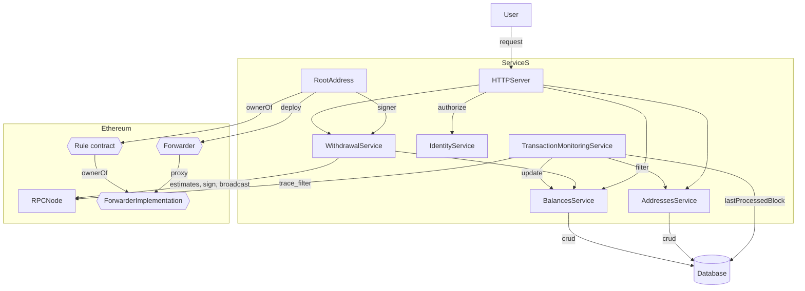

# Components diagram

Diagram below describe relations between different components of the system. To find more explanation about it please check [architecture](./ARCHITECTURE.md).

```mermaid
flowchart
  User --> |request| HTTPServer

  subgraph ServiceS

    RootAddress
    RootAddress --> |signer| WithdrawalService
    HTTPServer --> |authorize| IdentityService
    HTTPServer --> AddressesService
    HTTPServer --> BalancesService
    HTTPServer --> WithdrawalService
    WithdrawalService --> BalancesService
    TransactionMonitoringService --> |filter| AddressesService
    TransactionMonitoringService --> |update| BalancesService
  end

  RootAddress --> |deploy| Forwarder
  TransactionMonitoringService --> |lastProcessedBlock| Database
  TransactionMonitoringService --> |trace_filter| RPCNode
  RootAddress --> |ownerOf| Rule
  AddressesService --> |crud| Database
  BalancesService --> |crud| Database
  WithdrawalService --> |estimates, sign, broadcast| RPCNode

  subgraph Ethereum
    Forwarder{{Forwarder}} --> |proxy| ForwarderImplementation{{ForwarderImplementation}}
    Rule{{Rule contract}} --> |ownerOf| ForwarderImplementation{{ForwarderImplementation}}
    RPCNode
  end

  Database[(Database)]

```
